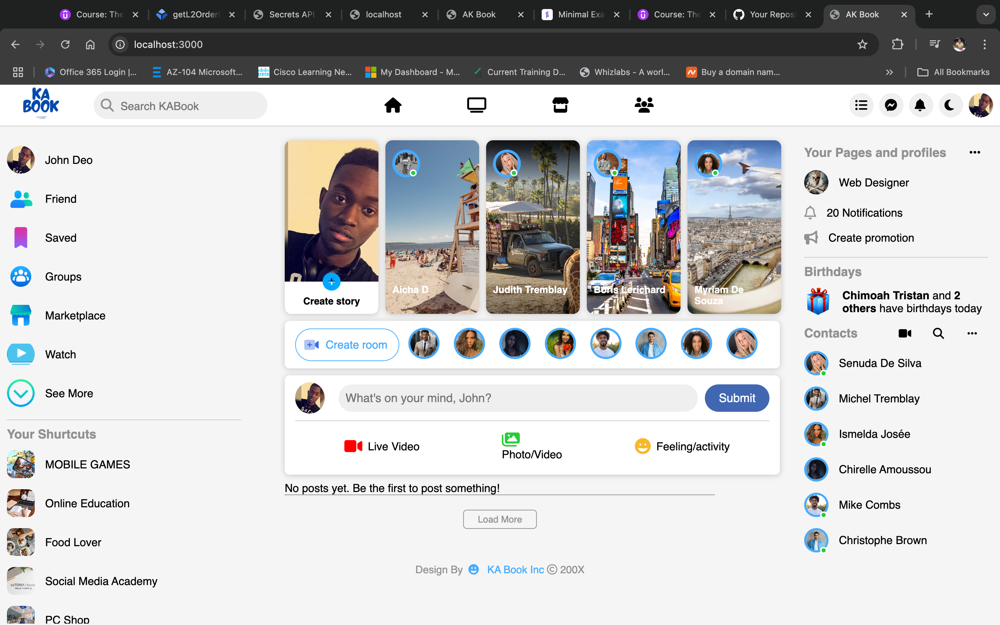
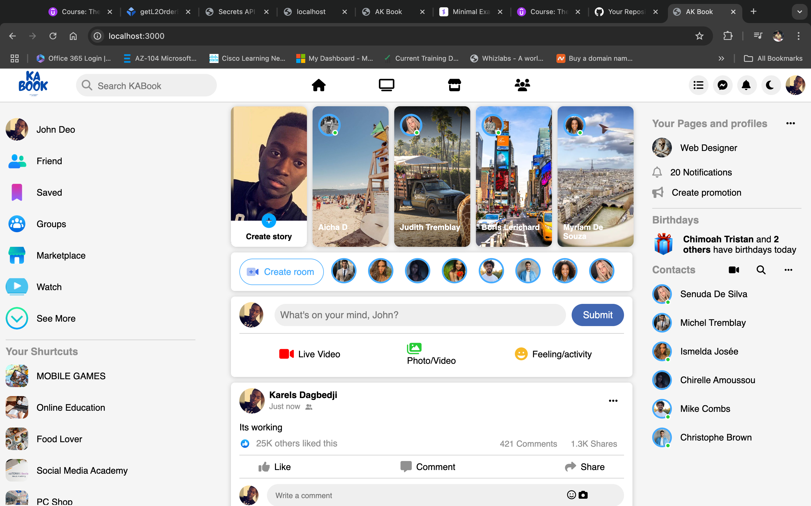

# AKBook is a Facebook clone

A clone of the Facebook website built for educational purposes. This project demonstrates basic social media functionalities such as posting, updating and deleting post. Built with HTML, CSS, Node.js, Express, and EJS templating.

**Note**: This project is not affiliated with or endorsed by Facebook.

## Features
- User is able to Create, Edit, and Delete Posts
- Like and Comment on Posts is not working at this time

## Technology Stack
- **Frontend**: HTML, CSS
- **Backend**: Node.js, Express.js
- **Templating Engine**: EJS

## Installation

### Prerequisites
- Node.js and npm installed

### Steps
1. Clone the repository:
   ```bash
   git clone https://github.com/your-username/facebook-clone.git
   ```
2. Navigate into the project directory:
   ```bash
   cd facebook-clone
   ```
3. Install dependencies:
   ```bash
   npm init -y
   npm install express ejs
4. Add to the package.json:
   type: module 
5. Start the server:
   ```bash
   npm start
   ```
6. Open your browser and go to `http://localhost:3000`.

## Usage

### Register and Log In
- Visit the login page and create a new account or log in with an existing account.

### Screenshots

[News Feed](screenshots/premierepage.png)


## License
MIT License
